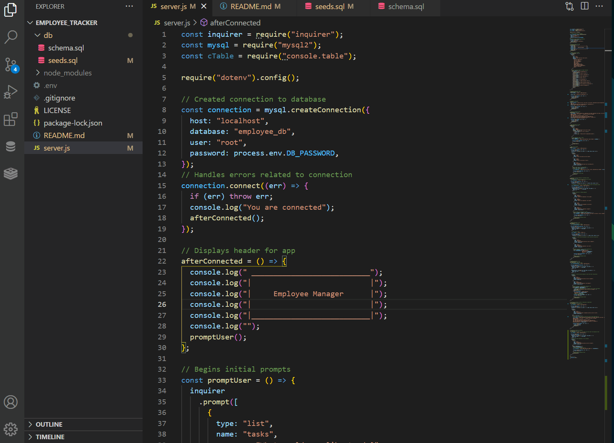

# employee_tracker

Employee Tracker
[[Repository Link](https://github.com/ElusiveSkies/employee_tracker)]

## Table of Contents

- [Installation](#Installation)
- [Usage](#Usage)
- [License](#License)
- [Questions](#Questions)

## Description

An application that prompts for user input resulting in the following changes to the database:
```md
GIVEN a command-line application that accepts user input
WHEN I start the application
THEN I am presented with the following options: view all departments, view all roles, view all employees, add a department, add a role, add an employee, and update an employee role
WHEN I choose to view all departments
THEN I am presented with a formatted table showing department names and department ids
WHEN I choose to view all roles
THEN I am presented with the job title, role id, the department that role belongs to, and the salary for that role
WHEN I choose to view all employees
THEN I am presented with a formatted table showing employee data, including employee ids, first names, last names, job titles, departments, salaries, and managers that the employees report to
WHEN I choose to add a department
THEN I am prompted to enter the name of the department and that department is added to the database
WHEN I choose to add a role
THEN I am prompted to enter the name, salary, and department for the role and that role is added to the database
WHEN I choose to add an employee
THEN I am prompted to enter the employee’s first name, last name, role, and manager, and that employee is added to the database
WHEN I choose to update an employee role
THEN I am prompted to select an employee to update and their new role and this information is updated in the database 
```

## Installation

From the integrated terminal the user will type:

  **npm i**

Followed by pressing enter.
This will result in the installation of *inquirer*, *MySQL2*, and *console.table*

## Usage

Entering the following in the integrated terminal to begin:
**node server.js**

Video of Usage


## License

MIT

## Questions

[[Contact me](mailto:elusiveskies@gmail.com)]

[[Elusiveskies](https://www.github.com/Elusiveskies)]